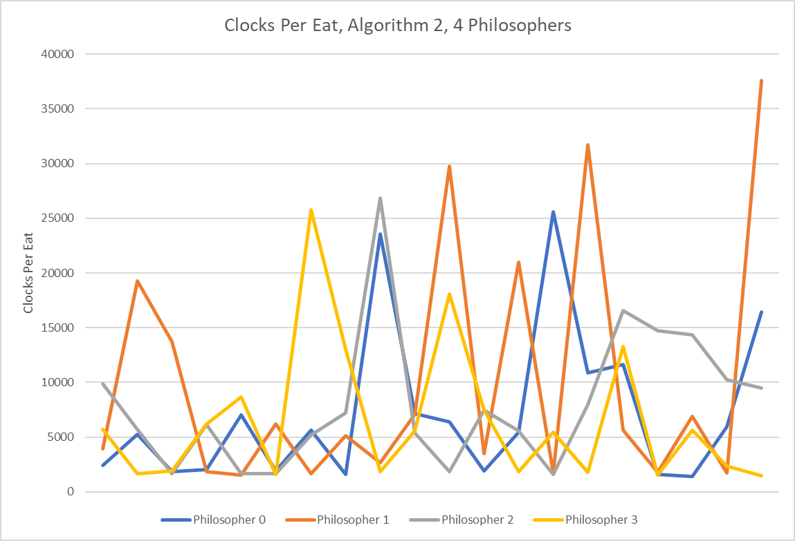
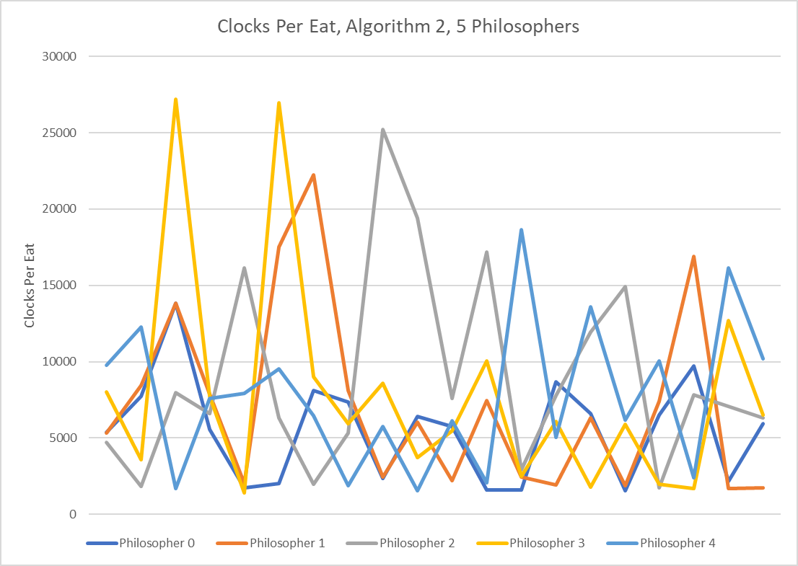
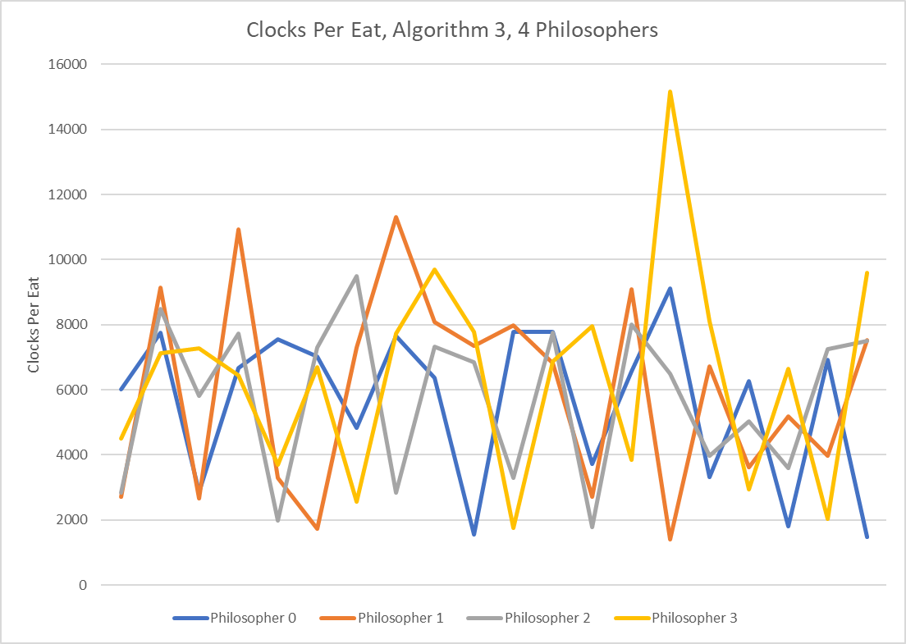
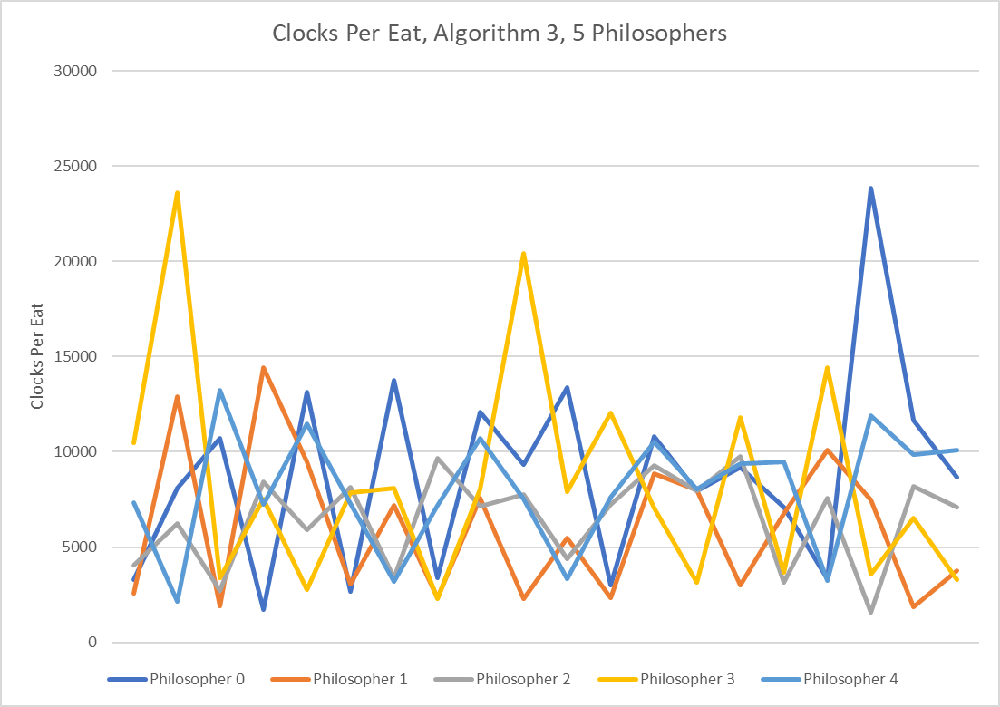

# Concurrency Solutions
## How to Run
Running `make` should make all of the executables. If you want to make a specific executable you can do so by running `make [executable name]`.

The executables for Dining Philosophers are named `dpN.exe` where `N` is the number of the algorithm. The executable for the Shuttle Problem is named `sh.exe`.

Dining Philosophers accepts one command line argument - the number of philosophers, which must be between 3 and 20 (nclusive).

## Dining Philosophers
Each algorithm is implemented in separate .c files named `diningPhilosophersAlgoN.c` where `N` is the number of the algorithm. Each also has a .h file with the same naming scheme.

### Algorithm Analysis (WIP)
- [`diningPhilosophersAlgo1.c`](diningPhilosophersAlgo1.c)
    - This algorithm deadlocks. Parameters don't really matter here. It happens regardless of time, it's just a matter of when.
- [`diningPhilosophersAlgo2.c`](diningPhilosophersAlgo2.c)
    - This algorithm does not deadlock. However, it does starve at times. We can see this in measuring the "Clocks Per Eat" over time for each philosopher, which is defined below in the Methodology section. 
    - For both 4 and 5 philosophers we can see that philosophers are somewhat inconsistently starving. In other words, a philosopher will have a relatively small number of clocks per eat, and will then randomly have a large spike. 
        - It seems that this is more accentuated with 4 philosophers. The statistics back this up as well, as the standard deviation with 4 philosophers (8066) is significantly higher than the standard deviation with 5 philosophers (5749). 
    -  
    -  
- [`diningPhilosophersAlgo3.c`](diningPhilosophersAlgo3.c)
    - This algorithm does not deadlock. However, like algorithm 2, it does starve at times. Similar to algorithm 2, the philosophers are somewhat inconsistently starving. However, it seems as though this is more accentuated with 5 philosophers than with 4 for this algorithm. We can see this by looking at the graphs, and by seeing that the standard deviation of the sample with 5 philosophers (4344) is much higher than with 4 philosophers (2735).
    - For some reason, the difference between the total clocks for 4 and 5 philosophers for algorithm 2 (642149 and 746780 respectively) is much smaller than the difference between 4 and 5 philosophers for algorithm 3 (476312 and 756718 respectively).
        - It seems that there's some sort of parity related inefficiency in the odd case for algorithm 3 (or possibly more accurately an efficiency in the even case) but I can't for the life of me figure out what it could be.
    - Another interesting tidbit I noticed is that for both algorithms, the medians increase a bit when there are more philosophers. This makes sense because each philosopher would get less CPU time overall when there are more of them.
        - For algorithm 2, the medians are 5631 and 6357 for 4 and 5 philosophers respectively. For algorithm 3, the medians are 6679.5 and 7553.5 for philosophers 4 and 5 respectively. 
    -  
    -  

#### Files
All of the files used for the algorithm analysis can be found in the [misc](misc/) folder. The outputs that they come from are in the [misc/outputs](misc/outputs/) folder, and their corresponding graphs can be found in the [misc/img](misc/img/) folder. Both the outputs and their corresponding images are named `dpN-P` where `N` is the number of the algorithm and `P` is the number of philosophers used when running the algorithm.

#### Methodology
"Clocks Per Eat" is defined as the number of clocks between each instance of `eat()` being called on an individual thread (ie Philosopher) basis.

All four samples I used used the first 20 Clocks Per Eat for each philosopher outputted by the program. This does not include the first ones for each philosopher since that would be calculating the time since the thread itself started.

For both algorithms, I made sure to test for 4 and 5 philosophers to ensure that parity wasn't having an effect on results.

I calculated the average, median, standard deviation, and total number of clocks for each of the samples using Excel. The graphs were also created using Excel. The [Excel file](misc/Graphs.xlsx) is included in the [misc](misc/) folder.

## Shuttle Problem
### A Note
For some reason, every once in a while this randomly stalls at the beginning (ie none of the threads get started), so if that happens just retry running the executable a few times and it should fix itself.

### Comments
- See my comments in my code for slightly more detail and context for all of this.
- The main thing to note is that the `numAttendees` variable keeps track of the number of attendees currently waiting at the bus stop. 
    - There is a semaphore called `checkAttendees` for locking around this variable. 
    - There are 3 attendees threads that sleep a random amount of time and then increment this variable, representing a new attendee waiting at the bus stop. 
    - This variable is decremented by 30 every time the bus comes, or by the value of the variable if the value is less than 30 (ie the value of the variable becomes 0).
- The `attendeesQueue` variable in the `attendees()` function keeps track of the number of attendees that come while the shuttle is picking attendees up in order to fulfill the "if there were more than 30 people waiting, they would also have to hang out for the next shuttle" constraint. 
    - Once the shuttle has departed (kept track of using a global boolean variable called `shuttleThere`), the `attendeesQueue` is reset to 0 after being added to the `numAttendees` to symbolize the people who got in line while the bus was there getting into the "actual queue." 
    - Both `attendeesQueue` and `shuttleThere` have semaphores for locking around them, `checkAttendeesQueue` and `checkShuttle`, respectively.
